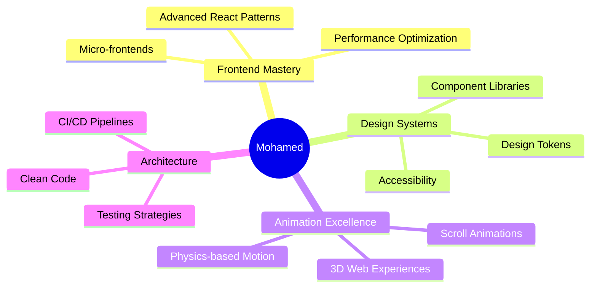

# ⚡ Hey, I'm Mohamed Medhat — Frontend Engineer ⚡

<div align="center">
  
  

</div>

---

## 🔥 About Me

I'm a Frontend Engineer who loves creating **fast, modern and beautifully crafted UI**. I focus on React, TypeScript, animations, and scalable component architecture.

```typescript
const mohamed = {
  expertise: ["React", "TypeScript", "UI/UX", "Animations"],
  passions: ["Pixel-perfect design", "Clean code", "User experience"],
  currentlyLearning: "Advanced animation techniques & 3D web experiences",
  funFact: "I believe great UI is invisible — users just feel it works"
};
```

- ⚡ Expert in **React & TypeScript**
- 🎨 Strong **UI/UX design systems**
- 🚀 Pixel-perfect **component engineering**
- 🧩 Smooth animations (**Framer Motion · GSAP**)
- 🌐 Comfortable with **backend basics**

---

## 🎨 Frontend Tech Stack

<div align="center">

### Core Technologies


### Styling & UI


### Animation & Motion


### State Management & Data


</div>

---

## ⚙️ Tools & Other Skills

<div align="center">


</div>

---

## 📊 GitHub Stats

<div align="center">
  
  
  
  
  
  

</div>


<!-- =============================================================== -->
<!-- 🔥 NEW COOL SECTION #2 – Activity Graph -->
<!-- =============================================================== -->

<h2 style="color:#00eaff; text-shadow:0 0 10px #00eaff;">📈 GitHub Activity Graph</h2>

<div align="center">
  
</div>

<hr style="border: 1px solid #ff00ff; box-shadow: 0 0 8px #ff00ff;" />

<!-- =============================================================== -->
<!-- 🔥 NEW COOL SECTION #3 – 3D Contribution Graph -->
<!-- =============================================================== -->

<h2 style="color:#ff00ff; text-shadow:0 0 10px #ff00ff;">🧊 3D Contribution Graph</h2>

<div align="center">
  
</div>

---

## 🎯 Current Focus

<div align="center">



</div>

---


---

## 🌟 Featured Skills Matrix

<div align="center">

| Skill Category | Technologies | Proficiency |
|:--------------:|:------------|:----------:|
| **Frontend Frameworks** | React, Next.js, Vue | ████████░░ 80% |
| **Languages** | TypeScript, JavaScript | █████████░ 90% |
| **Styling** | Tailwind, Styled-Components, CSS | ████████░░ 85% |
| **Animations** | Framer Motion, GSAP, Three.js | ███████░░░ 75% |
| **State Management** | Redux, Zustand, React Query | ████████░░ 80% |
| **Testing** | Jest, Testing Library, Cypress | ██████░░░░ 65% |
| **Backend** | Node.js, Express, REST APIs | ██████░░░░ 60% |

</div>

---

## 🎮 Code Activity

<div align="center">

<!--START_SECTION:waka-->
<!--END_SECTION:waka-->


</div>

---

## 🔗 Connect With Me

<div align="center">

[](https://www.linkedin.com/in/mohamed-medhat-81425a265)
[](https://mohamed-medhat.vercel.app)
[](mailto:mohamedmertens@gmail.com)

</div>

---

<div align="center">

### 💭 Dev Quote of the Day


---

### ⭐ Star my repositories if you find them useful!

**Made with 💙 and lots of ☕**

</div>
